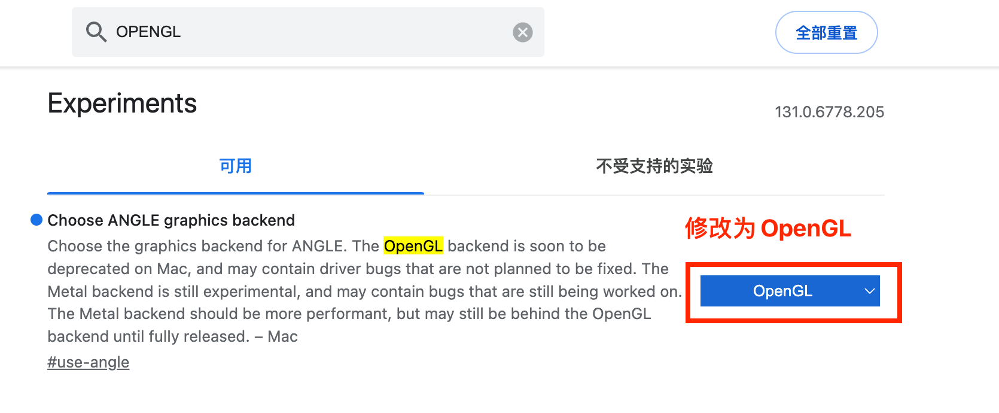

## 桃子自用版
- 修复原版 AX200 蓝牙不生效问题，使用的是修改好的蓝牙版本。虽然隔空投送依然是失灵
- 本人使用原版有概率启动黑屏，但修复此版无事，不知道哪里不兼容
- 使用 XHC 补丁取代 USBTOOL.kext，解决开机前使用无线鼠标 usb 锁死卡白果
- 本次EFI最佳匹配版本为 Mac OS Ventura
--------
# macOS on RedmiBook Pro 15S
## 配置

Type | Spec
:---------|:---------
Model Name | RedmiBook Pro 15S 2021
CPU | AMD Ryzen™ 7 5600H
RAM | 16 GB 3200 MHz DDR4
Wi-Fi | Intel® Wi-Fi 6 AX200
Audio | Realtek ALC256

## 安装时需要关闭的驱动

驱动 | 
:---------|
AirportItlwm |
IntelBluetoothFirmware |
IntelBluetoothInjector | 
IntelBTPatcher | 
BlueToolFixup | 
~~NootedRed~~ | 

> 当系统完全安装完毕时（系统激活完毕）将以上关闭驱动再次打开，如果你是5800H只需要修改AMD内核补丁即可。当前`OpenCore 1.0.2`

## 开启半硬解

驱动 | 
:---------| 
BFixup | 
NootedRed（原版） | 

> 顺序上请注意BFixup需要在NootedRed之前

用chrome浏览器打开`chrome://flags/`



## 继续使用AMDRyzenCPUPowerManagement

> 虽然 DirectHW性能更好，但是因为要兼顾切换低功耗保持办公能耗比，还是这个兼容比较好

## 虚拟化问题
目前仅只有Ventura（mac os 13.x）运行VirtualBox需要sudo。我只是用来安装Debian然后在里面安装docker完成项目的编译打包工作（内存只需要分配300MB），当然如果你有更复杂的操作可以考虑买一块RK3399开发版来满足你的需求，这两者目前我都有使用。

## ~~睡眠问题~~
~~通过ACPI补丁可以开启S3睡眠，但是会有些问题（第二个C口外界设备会导致秒醒）睡眠日志如下~~
```text
2024-09-03 09:52:49.341426+0800 0x75       Default     0x0                  0      0    kernel: (AppleACPIPlatform) AppleACPIPlatformPower Wake reason: GP17
2024-09-03 09:52:49.341427+0800 0x75       Default     0x0                  0      0    kernel: (AppleACPIPlatform) AppleACPIPlatformPower Wake reason: GP17
```
~~当前问题尚未能解决，如果改问题解决请联系我。~~

### 查看睡眠唤醒
```text
log show --last 20m | grep "Wake reason"
```


ACPI文件 | 作用
:---------|:---------
SSDT-BATT-fix | 修复电池循环
SSDT-BTIF.aml | 开启S3睡眠

> 这两个同时开启，电池百分比会用一段时间突然显示低电量（5%）实际上充电口是绿灯

电源设置


> 电池选项中请设置1分钟后睡眠，如果不设置在唤醒盒盖时内屏显示器无法关闭。

外接显示器用户，使用`BetterDisplay`软件来管理内屏显示体验会更加（由于我是4k显示器，红米这个本HDMI接口是残的只能4K30Hz体验太差了，无奈使用C to DP外接）


## 白果网卡
目前仅测试过两块白果网卡`BCM94360CS2`、`BCM94360Z4`这两块网卡蓝牙正常， WI-FI无法使用。在windows中网卡是正常使用，Hackintool能够识别PCIE地址但是无法使用Wi-Fi

## 内置麦克风
1. Set csr-active-config to 01000000.
2. [Download](https://github.com/qhuyduong/AMDMicrophone/releases/latest) the kext from Github Actions.
3. Copy it to /Library/Extensions/.

```shell
sudo cp -r AMDMicrophone.kext /Library/Extensions/
```


## 感谢
[JokerAB](https://github.com/JokerAB)、`Lynx`、[维奇](https://github.com/weachy) 提供的帮助，贾拉德大佬的bfix驱动
